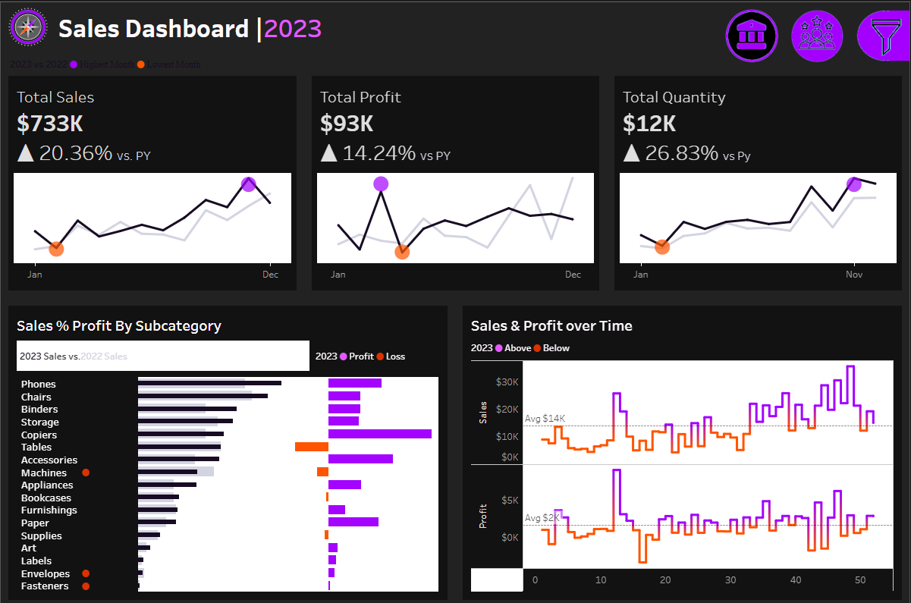
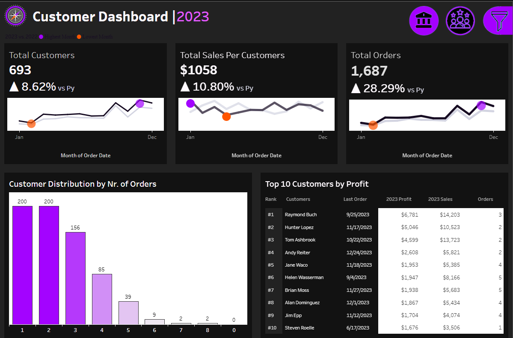
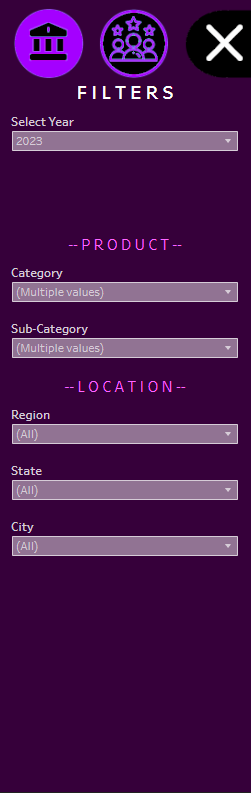

# 📊 Sales & Customer Dashboard | 2020–2023 (Tableau)

An interactive, multi-page Tableau dashboard designed to analyze key sales metrics, customer performance, and year-over-year trends from 2020 through 2023. It is structured to support strategic decision-making through advanced filtering, KPI comparisons, and segmented insights.

---

## 📌 Project Overview

This dashboard helps answer key business questions like:

- How have sales, profit, and order quantities evolved over time?
- What is the impact of each product subcategory on total profit?
- Who are the top-performing customers by revenue and profitability?
- Which regions, customer segments, and categories are driving business?

The dashboard dynamically adjusts to the selected year and **automatically compares each KPI to its previous year equivalent**.

---

## 🛠️ Tools Used

| Tool     | Purpose                          |
|----------|----------------------------------|
| **Tableau** | Interactive dashboard design and publishing |
| **Cleaned CSV/XLSX Dataset** | Source data, preprocessed and ready for analysis |

---

## 🗂️ Dashboard Layout

The application includes **three main components**, accessible via buttons in the top-right navigation bar:

### 1. 📈 Sales Dashboard
- KPIs: Total Sales, Total Profit, Total Quantity
- Year-over-year (YoY) comparison for each metric
- Monthly trend lines with highest/lowest month indicators
- Sales % Profit by Subcategory (2023 vs 2022 comparison)
- Weekly trend chart: Sales and Profit over time

### 2. 👥 Customer Dashboard
- KPIs: Total Customers, Total Orders, Sales per Customer
- Customer distribution by number of orders
- Top 10 Customers by Profit (with last order, sales, and order count)

### 3. 🧰 Filter Panel
Accessible from all pages via the filter icon, enabling:
- Year selection: 2020, 2021, 2022, 2023
- Product filters: Category, Sub-Category
- Location filters: Region, State, City

🧠 All KPIs and visualizations auto-update based on selected filters and year.

---

## 📈 Key Insights (2023 Example)

- Total Sales: **$733K** → ▲ 20.36% vs 2022  
- Total Profit: **$93K** → ▲ 14.24% vs 2022  
- Quantity Sold: **12K units** → ▲ 26.83% vs 2022  
- Underperforming categories: Machines, Accessories, Labels  
- Top customer by profit: Raymond Buch ($6,781 profit, $14,203 sales)

---

## 💡 Business Recommendations

- Focus marketing efforts on top 10 customers
- Reevaluate inventory strategies for low-profit categories
- Use customer segmentation for loyalty campaigns
- Improve cross-sell strategies in high-frequency customer segments

---

## 📁 Dataset Summary

- Cleaned dataset sourced from retail transactional data  
- ~16,000 transactions over 4 years  
- Fields: Order Date, Customer, Product, Sales, Profit, Quantity, Region, Segment  
- Fully preprocessed, no missing values or outliers

---

## 📸 Screenshots

> Screenshots will be added under `/dashboard/` folder.

### Sales Dashboard  

### Customer Dashboard  

### Filters Panel  

---

## 📬 Contact

**Author:** Seçkin Özler

**GitHub:** [https://github.com/seckinozler](https://github.com/seckinozler)  

**LinkedIn:** [https://www.linkedin.com/in/your-link-here](https://www.linkedin.com/in/seckinozler)

**Website:** [https://seckinsafakozler.wixsite.com/portfolio]((https://seckinsafakozler.wixsite.com/portfolio))
