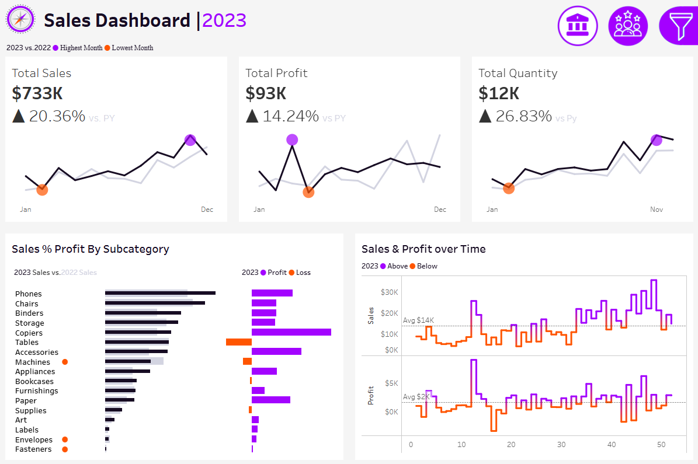
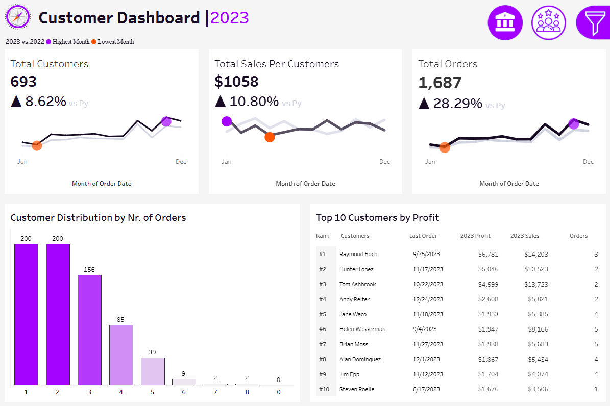
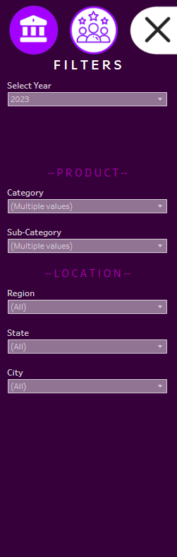

# 📊 Sales & Customer Dashboard | 2020–2023 (Tableau)

An interactive, multi-page Tableau dashboard designed to analyze key sales metrics, customer performance, and year-over-year trends from 2020 through 2023. It is structured to support strategic decision-making through advanced filtering, KPI comparisons, and segmented insights.

---

## 📌 Project Overview

This dashboard helps answer key business questions such as:

- How have sales, profit, and order quantities evolved over time?
- Which product subcategories contribute most to profitability or loss?
- Who are the top-performing customers based on profit?
- How do yearly trends compare with previous years (YoY)?

All KPIs dynamically update based on selected year (2020–2023) and are compared with the previous year.

---

## 🛠️ Tools Used

| Tool     | Purpose                                |
|----------|----------------------------------------|
| **Tableau** | Dashboard creation and interactivity |
| **Excel / CSV** | Cleaned dataset used as data source |

---

## 🌐 Live Interactive Dashboard

You can view the fully interactive Tableau dashboard online via Tableau Public:

🔗 **[Click here to open on Tableau Public](https://public.tableau.com/app/profile/seckin.ozler/viz/SalesCustomerDashboard_17173539058380/SalesDashboard)**

---

## 🗂️ Dashboard Structure

The Tableau project includes **three interactive views**, accessible via buttons in the top-right navigation:

### 1. 📈 Sales Dashboard
- KPIs: Total Sales, Total Profit, Total Quantity  
- Monthly trend with highest and lowest point highlights  
- Subcategory Profit % Comparison (2023 vs 2022)  
- Sales and Profit over time (weekly)  

### 2. 👥 Customer Dashboard
- KPIs: Total Customers, Total Orders, Sales per Customer  
- Customer order distribution  
- Top 10 Customers by Profit with Last Order & Order Count  

### 3. 🧰 Filter Panel
Accessible on all views, allowing filters by:
- **Year** (2020–2023)
- **Product**: Category, Sub-Category  
- **Location**: Region, State, City  

---

## 📈 Key Insights (2023 Example)

- Total Sales: **$733K** → ▲ 20.36% vs 2022  
- Total Profit: **$93K** → ▲ 14.24% vs 2022  
- Quantity Sold: **12K** → ▲ 26.83% vs 2022  
- Losses observed in: Machines, Accessories, Labels  
- Top Customer: **Raymond Buch** ($6,781 profit, $14,203 sales)

---

## 💡 Recommendations

- Focus on underperforming subcategories and optimize pricing
- Prioritize high-value customers with loyalty programs
- Launch year-end marketing campaigns based on seasonal peaks
- Improve retention in 1-2 order customer segments

---

## 📁 Dataset Summary

- Cleaned transactional sales dataset  
- 4 years of data (2020–2023)  
- 16,000+ orders across categories and regions  
- Fully preprocessed, no missing values  

---

## 📸 Screenshots

### Sales Dashboard  

### Customer Dashboard  

### Filters Panel  

---

## 📬 Contact

- **GitHub:** [github.com/seckinozler](https://github.com/seckinozler)  
- **LinkedIn:** [linkedin.com/in/seckinozler](https://www.linkedin.com/in/seckinozler/)  
- **Website:** [seckinsafakozler.wixsite.com/portfolio](https://seckinsafakozler.wixsite.com/portfolio)

---

